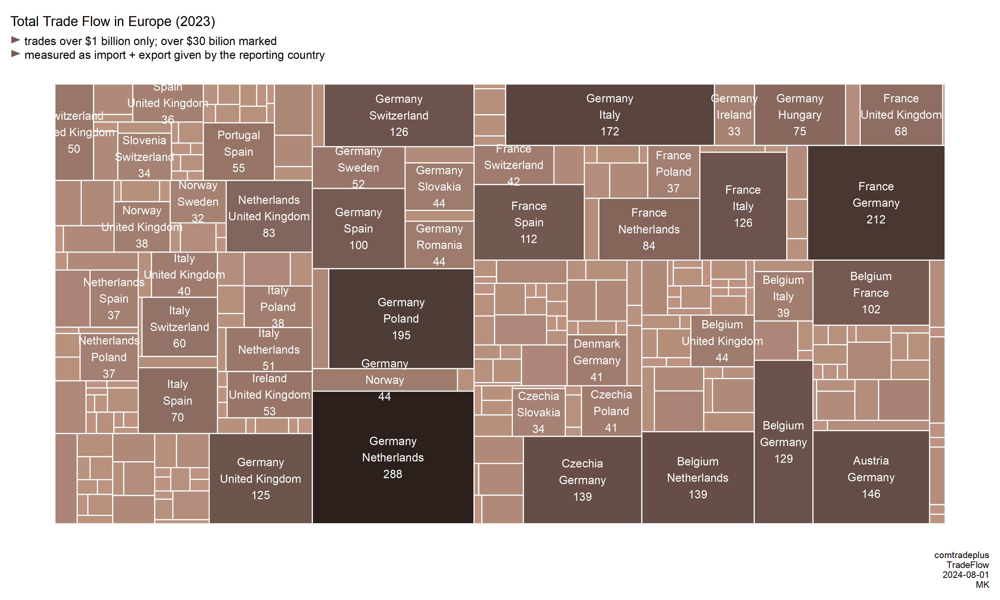

# InfoFlare

## Description
A collection of source codes for the Info Flare project run on the x.com platform. The aim of the project is to share interesting insights based on reliable sources of information.
                      
## Structure
Folders are named by the creation (or the latest modification) date. Each folder contains a collection of visualizations (.png and duplicates in .html foramt) and the source code (.qmd).

## Gallery 

2024-06-16

 
 
 
 
 
 

 

2024-06-17

 
 

 

2024-06-18

 
 

 

2024-06-19

 
 

 

2024-06-22

 
 

 

2024-06-24

 
 
 

 

2024-06-25

 
 
 

 

2024-06-27

 
 
 
 

 

2024-07-01

 
 

 

2024-07-08

 
 
 

 

2024-07-09

 

 

2024-07-23

 
 

 

2024-07-31

 
 
 

 

2024-08-04

 
 

 

2024-08-09

 
 

 

2024-08-10

 

 

2024-09-06

 
 

 

2024-09-09

 
 

