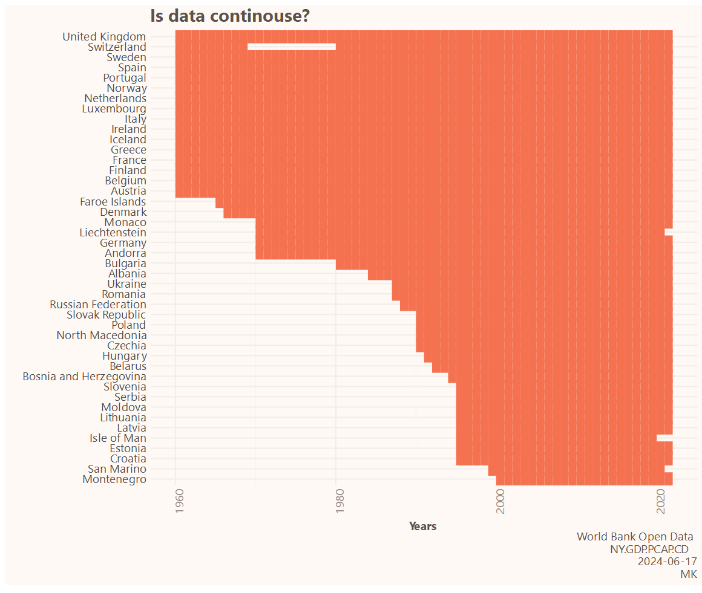

# InfoFlare

## Description

A collection of source codes for the Info Flare project run on the x.com platform. The aim of the project is to share interesting insights based on reliable sources of information.

## Structure

Folders are named by the creation (or the latest modification) date. Each folder contains a collection of visualizations (mostly .svg outputs saved as .html) and the source code (.qmd).
## Gallery

